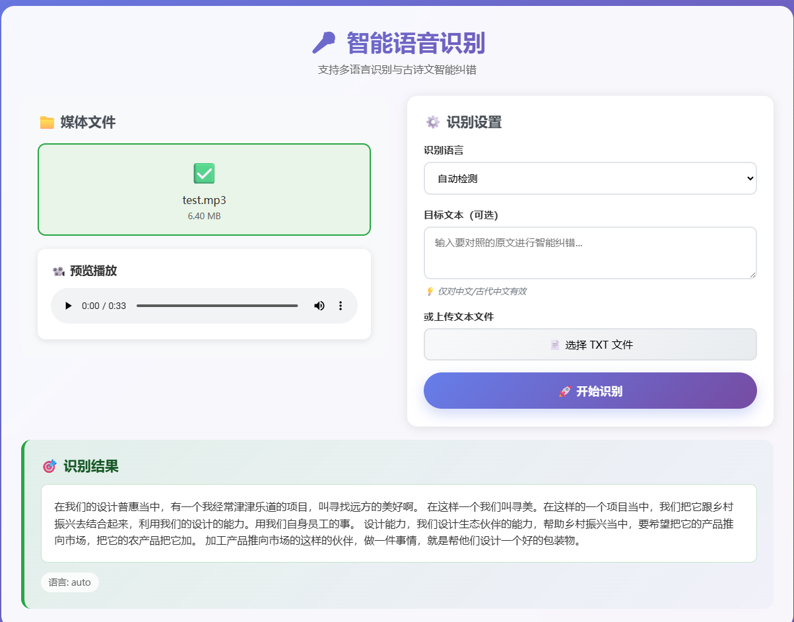
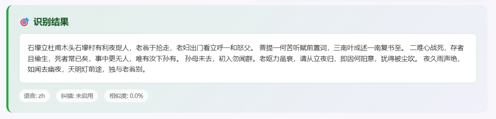
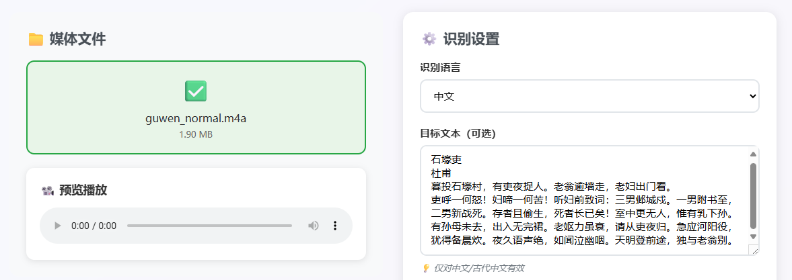
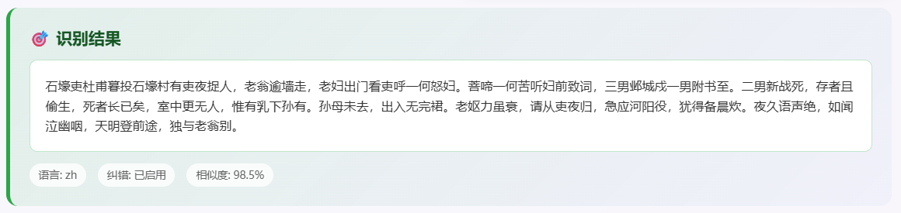

[简体中文](./Readme.md) | English

# SenseAlign ASR - ASR System Based on SenseVoice with Target Text Alignment

<div align="center">
    
</div>

   

**ASR System Based on SenseVoice Model with Target Text Alignment**

## 📖 Project Overview

SenseAlign ASR is a high-precision speech recognition system integrating target text alignment and error correction capabilities, featuring:

- **[SenseVoiceSmall Model](https://github.com/FunAudioLLM/SenseVoice)**: High-precision multilingual speech recognition model from Alibaba DAMO Academy
- **Target Text Alignment**: Intelligent error correction and content validation through comparison with preset target texts
- **Multilingual Support**: Supports Chinese, English, Cantonese, Japanese, Korean, and automatic language detection
- **Pinyin-level Correction**: Precise identification and correction of pronunciation errors based on pinyin similarity algorithms
- **Format Compatibility**: Supports WAV, MP3, FLAC, OGG, M4A, MP4, and various other audio/video formats

## 🔧 Core Technology

### Target Text Alignment Algorithm
The system employs **multi-layer pinyin similarity matching** technology for precise text alignment and error correction:

1. **Pinyin Parsing**: Decomposing Chinese characters into complete phonetic features of initials + finals + tones
2. **Similarity Calculation**: Handling common pronunciation confusions (ou/u, an/ang, en/eng, etc.)
3. **Dynamic Programming Alignment**: Using dynamic programming algorithms for optimal character sequence alignment

## 🚀 Quick Start

### Environment Setup

```bash
pip install -r requirements.txt -i https://pypi.tuna.tsinghua.edu.cn/simple
```

### Model File Preparation

Execute `download_models.py` to store the following model files in the `./models/iic/` directory:

- **[SenseVoiceSmall](https://www.modelscope.cn/models/iic/SenseVoiceSmall)**: Main multilingual speech recognition model
- **[speech_fsmn_vad_zh-cn-16k-common-pytorch](https://www.modelscope.cn/models/iic/speech_fsmn_vad_zh-cn-16k-common-pytorch)**: Voice Activity Detection (VAD) model

### Start Service

```bash
python flask_voice.py
```

After successful startup, visit `http://localhost:5001` to use the web interface for speech recognition.

## 📡 API Interface

### Speech Recognition and Alignment Interface

**Endpoint**: `POST /recognize`

**Request Parameters**:

| Parameter     | Type   | Required | Description                                    |
| ------------- | ------ | -------- | ---------------------------------------------- |
| audio         | file   | Yes      | Audio/video file                               |
| language      | string | No       | Recognition language (default: auto)           |
| target_string | string | No       | Target text for comparison, enables intelligent correction |
| target_file   | file   | No       | Target text file (.txt format)                |

**Supported Language Parameters**:
- `auto`: Automatic language detection
- `zh`: Chinese (enables target text alignment)
- `en`: English
- `yue`: Cantonese
- `ja`: Japanese
- `ko`: Korean

**Request Examples**:

```bash
# Target text-based alignment recognition
curl -X POST http://localhost:5001/recognize \
  -F "audio=@speech.wav" \
  -F "language=zh" \
  -F "target_string=Welcome to use SenseAlign speech recognition system, this is a high-precision ASR solution."

# Multilingual automatic recognition
curl -X POST http://localhost:5001/recognize \
  -F "audio=@meeting.mp3" \
  -F "language=auto"

# Alignment using target file
curl -X POST http://localhost:5001/recognize \
  -F "audio=@presentation.wav" \
  -F "language=zh" \
  -F "target_file=@target_script.txt"
```

### **Successful Response Example**:

```json
{
  "success": true,
  "language": "zh",
  "text": "Welcome to use SenseAlign speech recognition system, this is a high-precision ASR solution.",
  "correction_enabled": true,
  "similarity": 0.92
}
```

## 📁 Project Structure

```
SenseAlign-ASR/
├── flask_voice.py         # Flask main application
├── requirements.txt       # Python dependencies list
├── models/                # Model files directory
│   └── iic/
│       ├── SenseVoiceSmall/
│       └── speech_fsmn_vad_zh-cn-16k-common-pytorch/
├── uploads/               # Temporary file storage directory
├── static/                # Static resource files
├── templates/             # Web interface templates
└── README.md             # Project documentation
```

## 🎨 Recognition Results Display

### Web Interface Display

<div align="center">
    
</div>

### Demo1 (Without Alignment)

<div align="center">
    
</div>

### Demo2 (With Alignment)

<div align="center">
    
</div>

<div align="center">
    
</div>

## 🔧 Technical Support

### Dependent Projects
- [FunASR](https://github.com/alibaba-damo-academy/FunASR) - Speech recognition core framework
- [SenseVoice](https://github.com/FunAudioLLM/SenseVoice) - Multilingual speech recognition model
- [pypinyin](https://github.com/mozillazg/python-pinyin) - Chinese pinyin processing library
- [python-Levenshtein](https://github.com/ztane/python-Levenshtein) - String edit distance calculation